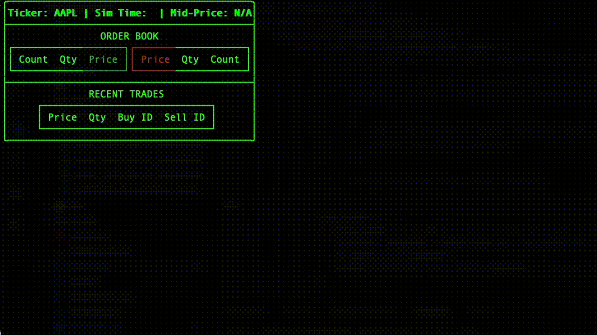

# C++ High-Performance Financial Matching Engine

> A command-line application that simulates a real-time, single-instrument order matching engine by replaying historical LOBSTER market data, featuring a dynamic Terminal User Interface (TUI).

This project is a high-performance simulation of a financial exchange's core functionality, built in modern C++.



---

## 📖 Overview

The application reads high-frequency limit order book data from a LOBSTER CSV file, which contains a timestamped sequence of all events that occurred on a trading day (new orders, cancellations, deletions, and executions).

It processes these events in a dedicated simulation thread, updating an in-memory order book that follows price-time priority. A separate UI thread renders the state of the order book and a log of recent trades in real-time, providing a dynamic view of the market's evolution.

The architecture is built on a classic **Producer-Consumer** pattern to decouple the high-performance simulation logic from the slower UI rendering, ensuring the engine can process events at maximum speed without being blocked.

## ✨ Key Features

*   **LOBSTER Data Processing:** Correctly parses the 6-column message file format, handling the four primary event types:
    1.  Add New Order
    2.  Partial Cancellation
    3.  Total Deletion
    4.  Visible Execution
*   **Price-Time Priority Matching Engine:** The core `OrderBook` class correctly implements the fundamental matching algorithm of modern exchanges.
*   **Dynamic Terminal User Interface (TUI):** A clean, real-time dashboard built with the **FTXUI** library, showing the top levels of the order book, recent trades, and key market statistics like mid-price.
*   **Variable-Speed Simulation:** The playback speed is user-configurable via a command-line argument, allowing for:
    *   **Maximum Speed Backtesting** (`speed_factor = 0`)
    *   **Real-Time Replay** (`speed_factor = 1`)
    *   **Accelerated Simulation** (`speed_factor > 1`)
*   **Decoupled Multithreaded Architecture:** A robust producer-consumer design that ensures the simulation is never blocked by UI rendering, solving common lock-contention bottlenecks.

---

## 🛠️ Architecture and Technical Deep Dive

The application is built on a two-thread model to ensure high performance and a responsive user experience.

#### 1. The Simulation Thread (The Producer)
*   **Role:** This thread is the engine's core. Its only job is to read the CSV file, parse messages, and update the state of the `OrderBook`. It runs as fast as the data processing and the configured `speed_factor` will allow.
*   **Ownership:** The `OrderBook` object is entirely owned by this thread. This is a key design decision that prevents the need for fine-grained locking on the order book's complex internal data structures.
*   **Key Data Structures:**
    *   `std::map`: Used for the bids and asks to automatically maintain sorting by price level.
    *   `std::unordered_map`: Provides O(1) average-time complexity for looking up any order by its unique ID, which is essential for handling cancellations and executions efficiently.
    *   **Cached Price Level Data:** To optimize performance, the total quantity and order count are cached at each price level, preventing expensive recalculations when the UI requests data.

#### 2. The UI Thread (The Consumer)
*   **Role:** This thread's only job is to render the user interface. It owns a local `ViewModel` which holds the state of the UI.
*   **Event-Driven Updates:** The UI does not poll for data. It waits to be woken up by the simulation thread via an `ftxui::Screen::PostEvent` call.

#### 3. The Communication Channel: A Thread-Safe Queue
*   **Pattern:** The two threads communicate using a **thread-safe producer-consumer queue**. This is the critical component that decouples the threads.
*   **Mechanism:**
    1.  The **Producer** (simulation thread) periodically creates a complete `ViewModel` snapshot of the market's current state.
    2.  It `push`es this snapshot onto the `ThreadSafeQueue<ViewModel>`. This is a fast operation.
    3.  The **Consumer** (UI thread) wakes up, drains the queue by `pop`ping any pending snapshots, and updates its local state with the most recent one.
    4.  It then renders a new frame using its local state.
*   **Benefit:** This architecture ensures that the fast simulation thread never has to wait for the slow UI thread. It simply drops a message in the queue and moves on, eliminating lock contention and allowing the engine to run at its full potential.

---

## 🚀 Getting Started

### Prerequisites
*   A C++17 compliant compiler (GCC, Clang, MSVC)
*   CMake (version 3.16 or higher)
*   The FTXUI library (included as a submodule or downloaded)

### Building
The project uses a standard CMake workflow.

```bash
# 1. Clone the repository
git clone <your-repo-url>
cd <your-repo-directory>

# If FTXUI is not in the libs folder, clone https://github.com/ArthurSonzogni/FTXUI inside libs folder. later i will implement git submodule, if its that the case run git submodule update --init --recursive and no need to clone it.

# 2. Create a build directory
mkdir build && cd build

# 3. Configure the project
cmake ..

# 4. Compile the project
# On Linux/macOS
make
# Or using the platform-agnostic CMake command
cmake --build .

# The executable will be in the bin/ directory```

---

## 💻 Usage

The program is run from the command line, providing the path to the LOBSTER data file and a simulation speed factor.

**Command:**
```bash
./bin/matching_engine <path_to_csv> <speed_factor>
```

**Examples:**

*   **Run at Maximum Speed (Backtesting):**
    ```bash
    ./bin/matching_engine ../data/AAPL_2012-06-21_message_10.csv 0
    ```

*   **Run in Real-Time:**
    ```bash
    ./bin/matching_engine ../data/AAPL_2012-06-21_message_10.csv 1
    ```

*   **Run at 100x Accelerated Speed:**
    ```bash
    ./bin/matching_engine ../data/AAPL_2012-06-21_message_10.csv 100
    ```

---

## 💡 Future Work

This project provides a solid foundation that can be extended in many ways:

*   **Upgrade to a Lock-Free Queue:** Replace the simple mutex-based `ThreadSafeQueue` with `boost::lockfree::spsc_queue` to eliminate locking entirely and maximize throughput.
*   **Add More Order Types:** Implement more complex order types like Iceberg orders or Immediate-Or-Cancel (IOC).
*   **Multiple Instruments:** Adapt the engine to handle order books for more than one financial instrument.
*   **Trade Logging:** Log all generated trades to an output CSV file for analysis.